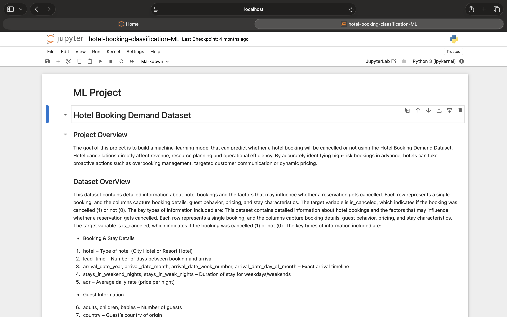
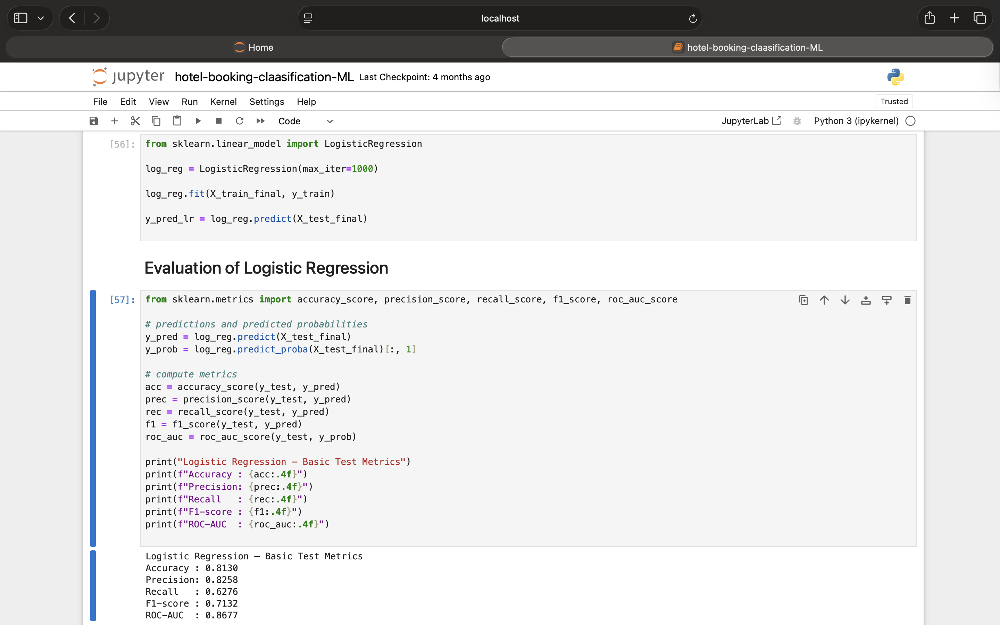
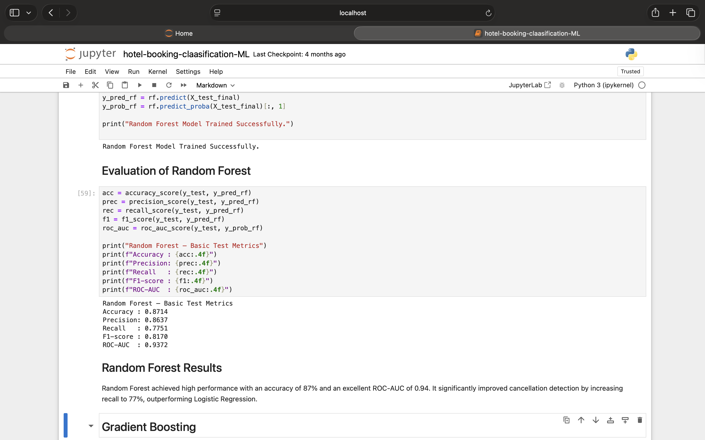
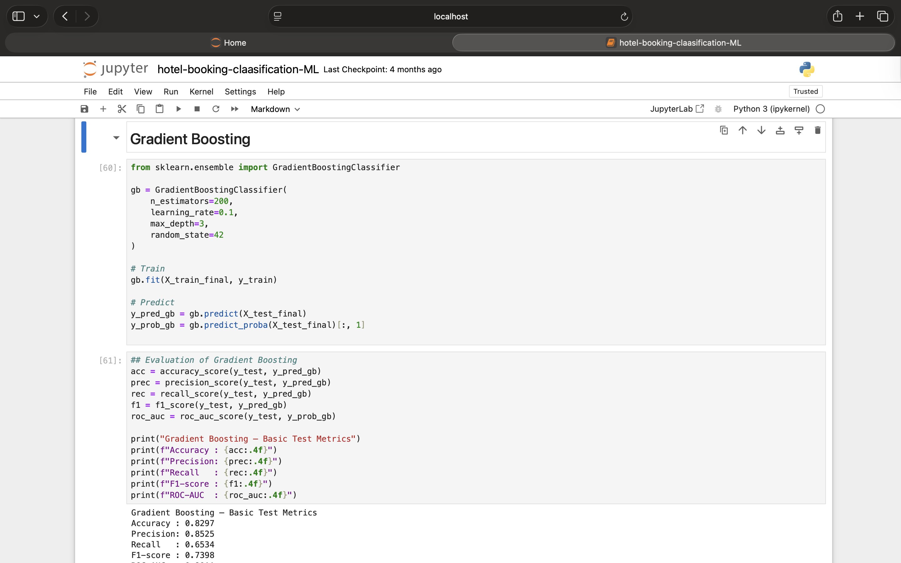
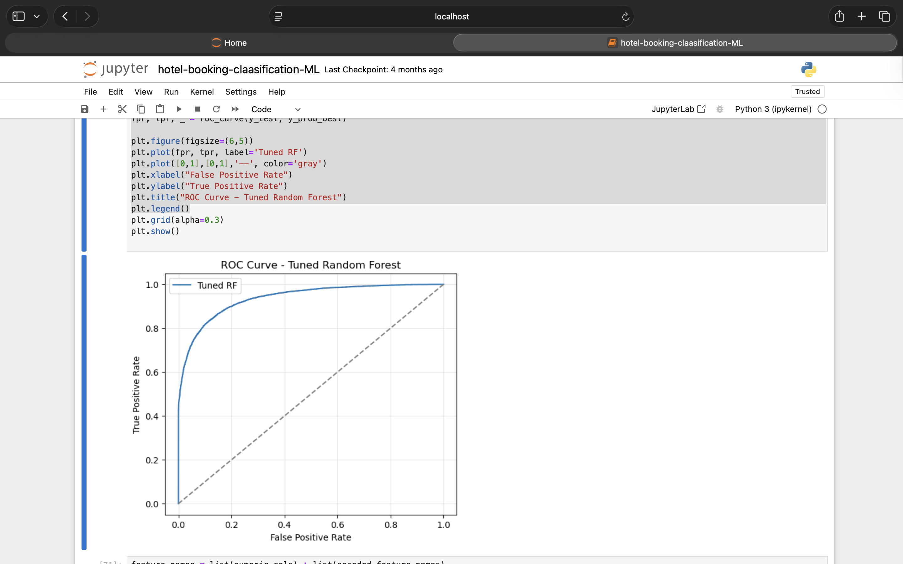
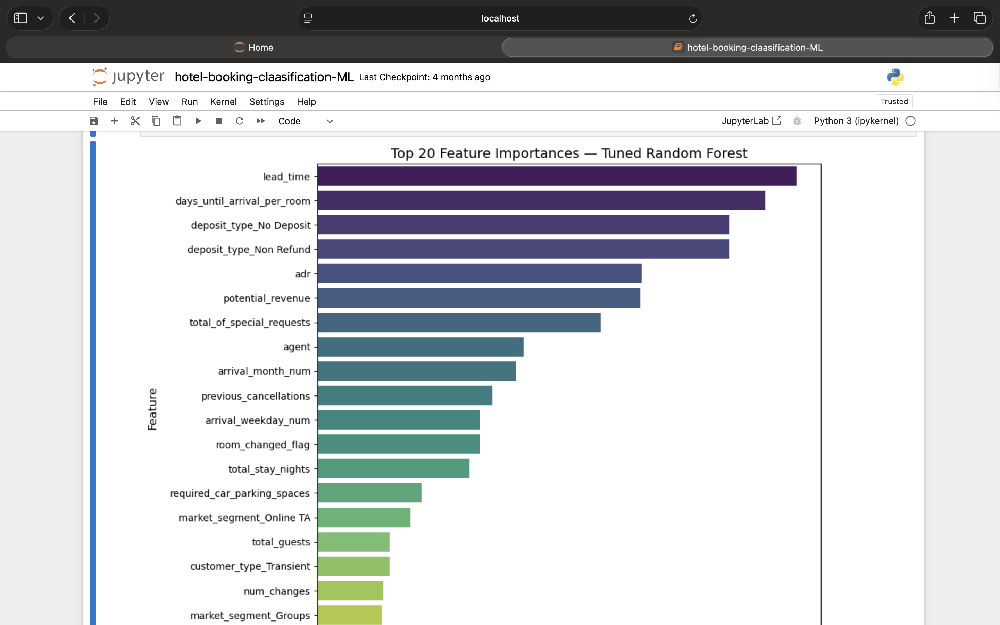
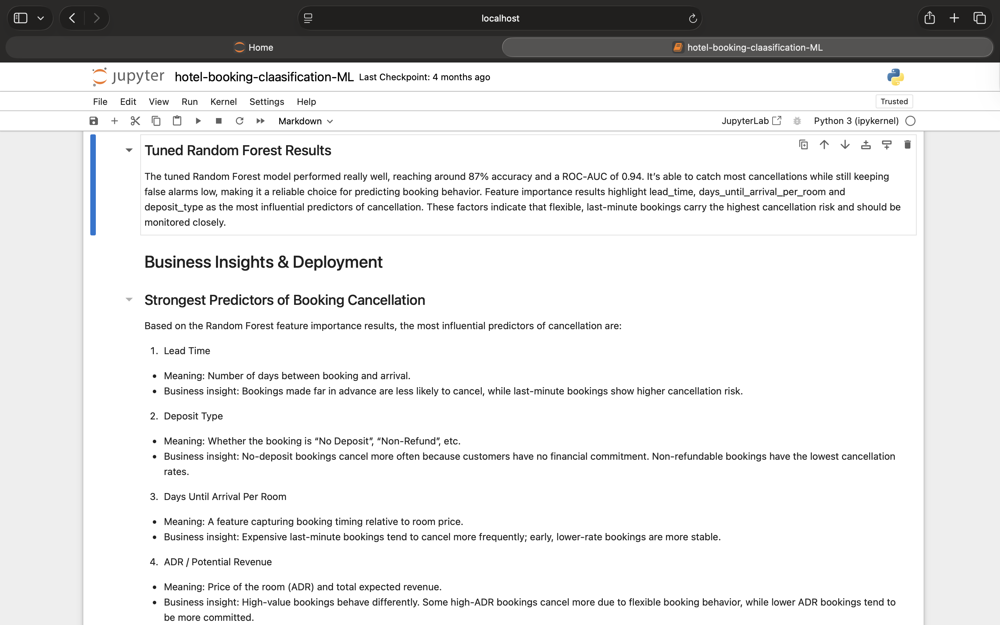

# Hotel Booking Cancellation Prediction (Machine Learning)

## Overview
This project predicts whether a hotel booking will be cancelled using machine learning classification techniques.

## Tools & Technologies
- Python
- Pandas, NumPy
- Scikit-learn
- Matplotlib / Seaborn

## Key Steps
- Data cleaning and preprocessing
- Feature engineering
- Model building (classification)
- Model evaluation
- Compared multiple models
- Hyperparameter tuning

## Model Performance
- Accuracy: ~90%
- Evaluated using Precision, Recall, F1-score, ROC-AUC

## Outcome
Built a predictive model to help hotels reduce cancellations and improve planning for over booking.

## Project Workflow

### 1. Data Overview

### 2. Model Training

### 3. Model Comparison

### 4. Hyperparameter Tuning

### 5. ROC Curve

### 6. Feature Importance

### 7.Business Insights

### 6. Feature Importance

